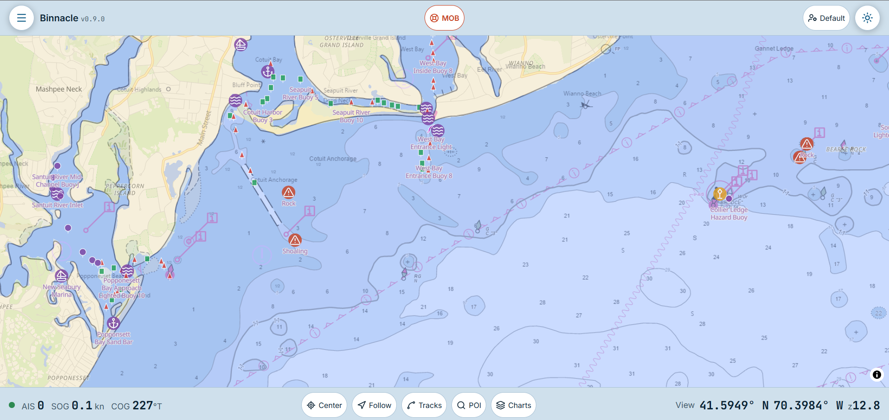
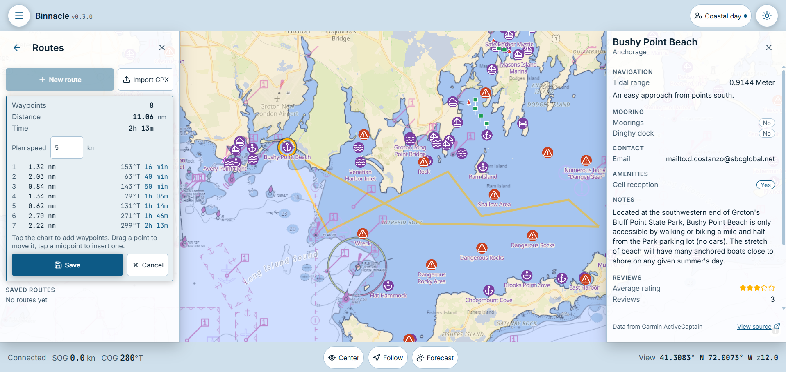
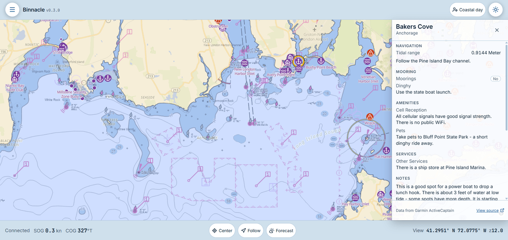
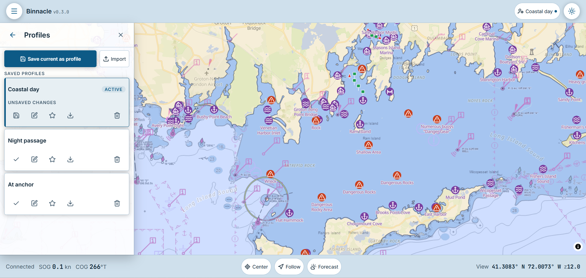
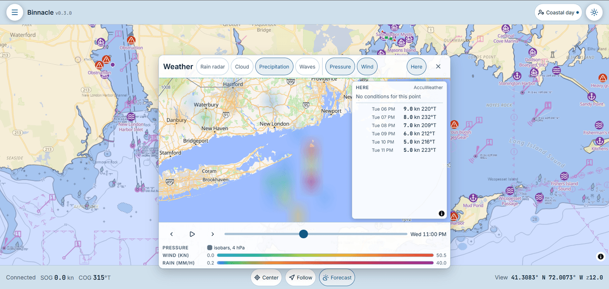

# Binnacle

[](https://www.npmjs.com/package/signalk-binnacle)
[](https://www.npmjs.com/package/signalk-binnacle)
[](https://github.com/NearlCrews/signalk-binnacle/actions/workflows/ci.yml)
[](https://github.com/NearlCrews/signalk-binnacle/actions/workflows/signalk-webapp-ci.yml)
[](https://github.com/NearlCrews/signalk-binnacle/blob/main/LICENSE)
[](https://nodejs.org)
[](https://www.buymeacoffee.com/nearlcrews)

A WebGL chart plotter for [Signal K](https://signalk.org).

> **It has not been field-tested at any scale.** It has been developed and verified against a single
> Signal K server, never across a fleet or a range of real-world boats, hardware, and conditions. It
> is also not certified for safety-of-life navigation. Always carry redundant means of navigation,
> cross-check against your primary instruments, and treat every display as advisory.

## What's new in 0.6.0

Offline that actually holds up, a launcher menu, your units everywhere, and 24 hour trends:

- **Offline charts everywhere.** Viewed PMTiles chart areas are cached as blocks in browser
  storage at the protocol layer, so they render offline in every context, including the
  plain-http default where no service worker can run. Over https, plugin chart tiles, the
  overlays, the base style, and tide predictions gain service-worker caching, and when the base
  style itself is unreachable the map starts on a minimal water fallback instead of staying
  blank. Tides, chart notes, and the conditions panel survive an offline reload, each item
  declaring its own age.
- **Your units, everywhere.** Every readout follows the Signal K server's imperial-or-metric
  unit preference, converting at the display edge; knots, nautical miles, and bearings stay
  nautical.
- **A launcher menu and an Alarms panel.** The menu is now large icon tiles grouped Navigate,
  Conditions, Safety, and Settings, and a new Alarms panel collects every active alert on the
  boat with one-tap Silence and Acknowledge that propagate to every station.
- **Trends and track history.** Depth, apparent wind, pressure, and speed over the last 24 hours
  as themed graphs from the server's v2 History API, falling back to live session sampling
  without a provider, plus a dashed 24 hour track-history chart layer.
- **Standard waypoints, worldwide tides, AIS trails, and chart symbols.** Waypoints live in the
  server's own resources, tides ride the signalk-tides plugin with NOAA CO-OPS as the fallback,
  AIS targets get faded wakes from the tracks plugin, and signalk-symbol-manager artwork renders
  on notes and waypoints, remapped into the red band at night.
- **Background-tab safety.** Delta batching and AIS pruning moved off the render loop, so live
  data, the collision watch, and the anchor alarm keep working while the browser tab is hidden.

See the [changelog](CHANGELOG.md#v060) for the full list.

## What it does

Signal K is an open marine data standard that streams a boat's navigation, environment, and AIS data
over a single API. Binnacle displays that data: a GPU-rendered, offline-capable chart plotter that
runs in a browser and is served by the boat's Signal K server.

It is built for low-bandwidth, offline use on modest hardware. It has night-readable themes, computes
collision and course data on the client when no server provider supplies them, and caches viewed
areas so they keep rendering without a connection. It runs on the same Raspberry Pi that hosts the
Signal K server.

## Features

Binnacle ships its full feature set as a Signal K webapp:

- **Charts and layers:** a GPU vector base map, server charts, four streaming bathymetry and ENC
  sources (NOAA ENC, BlueTopo, and EMODnet each add a nested survey-quality facet; GEBCO is global
  base bathymetry), and your own PMTiles charts added by URL or served from the server's charts
  folder, in a collapsible, categorized Layers panel with per-layer toggle, fade, and drag-reorder.
  A 24 hour **track history** layer draws the server-recorded past day under the live track.
- **Overlays:** free, key-free OpenSeaMap seamarks, marine protected areas, maritime boundaries, and
  NASA GIBS ocean conditions (sea-surface temperature and sea ice), each with its source attribution.
- **Routing:** draw and save routes as Signal K resources, or tap **Go to here** (long-press or
  right-click the chart) to navigate straight to a point. Follow a route with a nav strip (cross-track,
  distance, bearing, velocity made good, and time to go) over the v2 Course API, with an arrival alarm
  and skip-waypoint controls. A plan speed turns the route into a **passage plan** with per-waypoint and
  whole-route arrival times, and routes **import and export as GPX** to move between Binnacle and other
  plotters and MFDs.
- **Profiles:** save named bundles of your settings (theme, which layers are on and their order, the
  weather layers, the collision thresholds, and the track and planning settings), switch between them
  in one tap, set a default, export and import them as files, and sync them across devices through the
  server when you are logged in.
- **Weather:** a zoom-capped mini-map with animated WebGL wind, pressure isobars, waves,
  precipitation, cloud, and radar, a tap-for-value readout, and a conditions and warnings panel.
- **Tides:** the nearest tide station's next high and low with a 48-hour curve and the nearest
  tidal-current station's next flood or ebb. NOAA CO-OPS covers US waters out of the box; the
  signalk-tides plugin extends coverage worldwide when the server runs it.
- **Lookout:** a collision watch with CPA and TCPA, chart-highlight rings, an audible alarm, and a
  published Signal K notification, plus a sortable **AIS target list** (by range, CPA, or name) with
  live range and bearing, tap-to-locate, and faded **target trails** from the tracks plugin. An
  **Alarms panel** collects every active alert on the boat (engine, autopilot, any plugin) with
  one-tap Silence and Acknowledge that propagate to every station.
- **Anchor watch:** drop the anchor at the boat, set the swing radius (or capture it from the live
  distance), and get a drag alarm that latches until acknowledged. It drives the
  signalk-anchoralarm-plugin when installed (so the alarm keeps running with the browser closed) and
  falls back to a fully in-browser watch when it is not, with a draggable drop-point marker on the
  chart.
- **Man overboard:** an always-visible MOB button in the top bar with a confirm pop-out. Confirming
  marks the spot, publishes the boat-wide Signal K alarm, and raises a recovery strip with live
  bearing, range, and elapsed time, plus an opt-in **Steer to MOB** handoff to the course system. An
  MOB raised by another station shows here too.
- **Measure:** tap points on the chart for per-leg range and bearing and a running total, labeled at
  the last point.
- **Tracks:** record, save, show, and export your voyage track as GeoJSON, save a track as a reusable
  route, reverse a route for the return leg, or navigate home by retracing your track.
- **Waypoints:** drop one from a long press, see them as named markers, and locate, go to, rename, or
  delete them from the Waypoints panel; they live in the server's waypoint resources, so they
  interoperate with every other Signal K client.
- **Trends:** depth, apparent wind, barometric pressure, and speed over the last 24 hours as themed
  graphs from the server's v2 History API, or live session sampling without a history provider.
- **Points of interest:** Crow's Nest, ActiveCaptain, and other notes as themed markers with a
  structured detail panel, plus custom chart symbols from the signalk-symbol-manager plugin.
- **Your units:** every readout follows the server's imperial-or-metric unit preference; knots,
  nautical miles, and bearings stay nautical.
- **Themes and offline:** day, dusk, and night-red themes, offline caching, and self-hosted assets.

See the [changelog](CHANGELOG.md) for the full list.

## Screenshots

| The chart with live AIS and the Layers panel | Route planning with a passage plan | An anchorage point-of-interest detail |
| --- | --- | --- |
| [](static/screenshots/01-chart.png) | [](static/screenshots/02-routes.png) | [](static/screenshots/03-anchorage.png) |

| Profiles | The weather mini-map |
| --- | --- |
| [](static/screenshots/04-profiles.png) | [](static/screenshots/05-weather.png) |

## Architecture

Binnacle is built on a current web stack and engineered to run on modest helm hardware:

- **Front end.** Svelte 5 with runes, Vite, and TypeScript, linted and formatted with Biome, with
  module boundaries enforced by the build (Feature-Sliced Design plus a dependency-cruiser gate).
- **GPU rendering.** MapLibre GL JS draws the vector base map and chart layers on the GPU. The own
  vessel and every AIS target render as GPU symbol layers, and wind draws as a WebGL particle field
  advected through the forecast on the graphics card.
- **Off-main-thread real-time pipeline.** A dedicated Web Worker hosts the Signal K WebSocket client;
  deltas are coalesced into frame-rate batches on a worker timer and fed into a path-keyed reactive
  store, so a busy AIS anchorage updates the readouts without stalling the chart render, and data and
  alarms keep flowing while the tab is in the background.
- **Minimal network and render work.** Binnacle subscribes to exactly what it draws, keeps everything
  in SI internally, and converts only at the display edge.
- **Offline caching.** Self-hosted fonts and assets (no CDN for app code). PMTiles chart areas are
  cached as blocks in IndexedDB at the protocol layer, so they work offline even over plain http;
  tides, notes, weather, and the vessel conditions persist the same way. Over https a service
  worker additionally caches the base map, plugin chart tiles, the overlays, and predictions.

## Requirements

- Signal K server 2.x.
- Node.js >= 22 (for building from source).
- A browser on the helm display, tablet, or phone.

## Installation

Binnacle is a Signal K webapp. The production build ships inside the package, so there is nothing to
build.

**From the App Store (recommended).** In the Signal K admin UI, open Apps and Plugins, then Store,
search for Binnacle, and install. Open it from the **Webapps** list.

**With npm.** Install into the server's home directory and restart Signal K:

```bash
cd ~/.signalk
npm install signalk-binnacle
```

**From source.** See [Development](#development) below.

## Offline operation and SSL (optional)

SSL is not required. Binnacle runs fully over plain HTTP, which is how the Signal K server serves it
by default: the chart, AIS, weather, points of interest, tracks, and the Lookout alarms all work
without it.

Much of the offline caching works without SSL. PMTiles chart areas, the weather forecast, tides,
chart notes, and the vessel conditions are cached in IndexedDB, which is not secure-context gated,
so even over plain HTTP a reload replays the last data and previously viewed PMTiles charts keep
rendering offline. What SSL adds is the service-worker layer: browsers expose the service worker
and cache-storage APIs only in a secure context (HTTPS or `http://localhost`), so caching the base
map, plugin-served chart tiles, and the streaming overlays activates only when the server is
reached over HTTPS. Over plain HTTP those degrade cleanly to online-only with no loss of live
function.

There are two good ways to add HTTPS to Signal K:

- The [signalk-ssl](https://www.npmjs.com/package/signalk-ssl) plugin
  ([source](https://github.com/dirkwa/signalk-ssl)), which generates a local certificate
  authority, issues the server certificate, and distributes the root to your devices by QR code.
  It runs its certificate tooling on the shared
  [signalk-container](https://github.com/dirkwa/signalk-container) runtime. The Signal K server's
  built-in SSL settings (Server, then Settings, then SSL) are a bare-bones alternative.
- [Tailscale](https://tailscale.com), which adds remote access and publicly trusted certificates
  (no trust-store step at all) in one move. See
  [Accessing Signal K remotely with Tailscale](https://gist.github.com/NearlCrews/3f7af717fec853a80e7de1063940382e)
  for a quick start, including a clean `signalk.<tailnet>.ts.net` service name.

One more step is required, and it is easy to miss: your browser has to **trust** that certificate,
not just reach it. A self-signed certificate, including one the signalk-ssl plugin generates, is not
trusted by default, and browsers refuse to register a service worker from an origin whose certificate
they do not trust, even after you click through the page's certificate warning. So if you only accept
the one-time warning, the page loads but offline caching never activates, and the console shows a
message like "service worker registration failed: an SSL certificate error occurred." To fix it,
install the certificate authority's root (the QR code or `.pem` the plugin gives you) into your
browser or operating system trust store and mark it trusted, then reload over HTTPS. Once the
certificate is trusted, the service worker registers and the base map and chart tiles cache for
offline use.

## Development

This project targets Node 22 or newer. Lint and format use the Biome binary, which must be installed
and on your `PATH` (CI installs it via the `biomejs/setup-biome` action).

```bash
git clone https://github.com/NearlCrews/signalk-binnacle.git
cd signalk-binnacle
npm install        # install dependencies
npm run hooks      # install the git pre-commit and pre-push gates (run once)
npm run dev        # Vite dev server
npm run check      # type-check (svelte-check)
npm run lint       # Biome lint
npm run format     # Biome format (write)
npm run cruise     # dependency-cruiser boundary check
npm test           # Vitest unit tests
npm run build      # production build into public/
npm run test:e2e   # Playwright end-to-end smoke test
```

After `npm run hooks`, git runs a fast format, lint, and boundary check before each commit, and the
full type-check, test, and build gate before each push. The hooks live in `.githooks/` and are opt-in
via `core.hooksPath`, never a package lifecycle script.

To run a local build inside your own Signal K server, link it into the server's module directory and
add it to the server config so it loads:

```bash
ln -sfn "$(pwd)" ~/.signalk/node_modules/signalk-binnacle
```

```json
{
  "dependencies": {
    "signalk-binnacle": "file:../path/to/signalk-binnacle"
  }
}
```

Restart Signal K, then open `http://your-sk-server:3000/signalk-binnacle/` in a browser.

## License

Apache-2.0. See [LICENSE](LICENSE) for the full text. The software is provided "AS IS", without
warranty of any kind. It has not been field-tested at scale and is not certified for navigation.
Treat all on-screen information as advisory, and always carry independent means of position-fixing.

## Acknowledgments

Binnacle is written and maintained by [Nearl Crews](https://github.com/NearlCrews). It stands on
open data and open source:

- [Signal K Project](https://signalk.org/) for the open marine data standard.
- [MapLibre GL JS](https://maplibre.org/) for the GPU map renderer, and
  [OpenFreeMap](https://openfreemap.org/) for the vector base map, built from
  [OpenStreetMap](https://www.openstreetmap.org/) data under the
  [Open Database License](https://opendatacommons.org/licenses/odbl/).
- [Open-Meteo](https://open-meteo.com/) for the forecast and marine wave grids, and
  [RainViewer](https://www.rainviewer.com/) for precipitation radar.
- [NOAA](https://www.noaa.gov/) for the ENC chart, BlueTopo bathymetry, the MPA Inventory, and the
  CO-OPS tide and current predictions; [EMODnet](https://emodnet.ec.europa.eu/) for European
  bathymetry and protected areas; [GEBCO](https://www.gebco.net/) for global bathymetry;
  [NASA EOSDIS GIBS](https://www.earthdata.nasa.gov/engage/gibs) for the ocean-conditions imagery;
  [OpenSeaMap](https://www.openseamap.org/) for the seamark overlay; and the
  [Flanders Marine Institute (VLIZ)](https://www.vliz.be/) Marine Regions service for the maritime
  boundaries.

Binnacle pairs well with sibling plugins such as
[`signalk-crows-nest`](https://github.com/NearlCrews/signalk-crows-nest), which supplies the points
of interest it renders, and works with any Signal K weather provider, such as
[`signalk-virtual-weather-sensors`](https://www.npmjs.com/package/signalk-virtual-weather-sensors).

## Support

Find this project useful? You can support its continued development by
[buying me a coffee](https://www.buymeacoffee.com/nearlcrews).

- [Report a bug](https://github.com/NearlCrews/signalk-binnacle/issues/new?template=bug_report.yml)
- [Request a feature](https://github.com/NearlCrews/signalk-binnacle/issues/new?template=feature_request.yml)
- [Security issues](.github/SECURITY.md)
